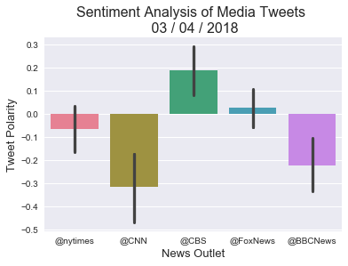

Background

In this assignment, you'll create a Python script to perform a sentiment analysis of the Twitter activity of various news oulets, and to present your findings visually.

Your final output should provide a visualized summary of the sentiments expressed in Tweets sent out by the following news organizations: BBC, CBS, CNN, Fox, and New York times.
The first plot will be and/or feature the following:

    Be a scatter plot of sentiments of the last 100 tweets sent out by each news organization, ranging from -1.0 to 1.0, where a score of 0 expresses a neutral sentiment, -1 the most negative sentiment possible, and +1 the most positive sentiment possible.
    Each plot point will reflect the compound sentiment of a tweet.
    Sort each plot point by its relative timestamp.

The second plot will be a bar plot visualizing the overall sentiments of the last 100 tweets from each organization. For this plot, you will again aggregate the compound sentiments analyzed by VADER.

The tools of the trade you will need for your task as a data analyst include the following: tweepy, pandas, matplotlib, seaborn, textblob, and VADER.

Your final Jupyter notebook must:

    Pull last 100 tweets from each outlet.
    Perform a sentiment analysis with the compound, positive, neutral, and negative scoring for each tweet.
    Pull into a DataFrame the tweet's source acount (user's name), its text, its date (created at), and its compound, positive, neutral, and negative sentiment scores.
    Export the data in the DataFrame into a CSV file.
    Save PNG images for each plot.

As final considerations:

    Use the Matplotlib and Seaborn libraries.
    Include a written description of three observable trends based on the data.
    Include proper labeling of your plots, including plot titles (with date of analysis) and axes labels.
    Include an exported markdown version of your Notebook called README.md in your GitHub repository.


```python
# Dependencies
import tweepy
import numpy as np
import pandas as pd
import matplotlib.pyplot as plt
from datetime import datetime
import os
import csv
from pprint import pprint
import seaborn as sns
# Import and Initialize Sentiment Analyzer
from vaderSentiment.vaderSentiment import SentimentIntensityAnalyzer
analyzer = SentimentIntensityAnalyzer()

# Twitter API Keys
consumer_key = "Mu92DNpvefQ4XfzeLnrwOPx99"
consumer_secret = "DybUt9nAcMZYtKporN8qyPig9JizczY6h3YsTah9Iy6nYVE7Xo"
access_token = "969394997077225473-uTQ6VIcY1zI5KjEzUl971BtKD5jPyac"
access_token_secret = "zWr5POWyJgY1HLEXSM5VQL8dB0PcNsoMJM0Tm6o1T9ARX"

# Setup Tweepy API Authentication
auth = tweepy.OAuthHandler(consumer_key, consumer_secret)
auth.set_access_token(access_token, access_token_secret)
api = tweepy.API(auth, wait_on_rate_limit=True, parser=tweepy.parsers.JSONParser())
```


```python
# Target Search Term
target_terms = ("@nytimes", "@CNN", "@CBS",
                "@FoxNews", "@BBCNews")
```


```python
# "Real Person" Filters
min_tweets = 5
max_tweets = 10000
max_followers = 2500
max_following = 2500
lang = "en"
```


```python
# Array to hold sentiment
sentiment_array = []
# Variables for holding sentiments
target_list=[]
source_list=[]
text_list=[]
created_list=[]
compound_list = []
positive_list = []
negative_list = []
neutral_list = []
cnt=[]
# Loop through all target users
for target in target_terms:
    counter=0

    # Variable for holding the oldest tweet
    oldest_tweet = None

    # make multiple requests
    for x in range(2):

        # Run search around each tweet
        public_tweets = api.search(
            target, count=50, result_type="recent", max_id=None)

            # Loop through all tweets
        for tweet in public_tweets["statuses"]:
            counter = counter + 1

            # Use filters to check if user meets conditions
            if (tweet["user"]["followers_count"] < max_followers
                and tweet["user"]["statuses_count"] > min_tweets
                and tweet["user"]["statuses_count"] < max_tweets
                and tweet["user"]["friends_count"] < max_following
                and tweet["user"]["lang"] == lang):

                # Run Vader Analysis on each tweet
                results = analyzer.polarity_scores(tweet["text"])
                compound = results["compound"]
                pos = results["pos"]
                neu = results["neu"]
                neg = results["neg"]

                # Add each value to the appropriate array
                target_list.append(target)
                source_list.append(tweet['user']['name'])
                created_list.append(tweet["created_at"])
                text_list.append(tweet["text"])
                compound_list.append(compound)
                positive_list.append(pos)
                negative_list.append(neg)
                neutral_list.append(neu)
                cnt.append(counter)
                
                # Set the new oldest_tweet value
        oldest_tweet = int(tweet["id_str"]) - 1

sentiment_df=pd.DataFrame({
                "News_Outlet": target_list,
                "Twitter_User":source_list,
                "Tweet_Text":text_list,
                "Created_At":created_list,
                "Compound": compound_list,
                "Positive": positive_list,
                "Neutral": neutral_list,
                "Negative": negative_list,
                "Tweets Ago": cnt
                })

#         # Set the new oldest_tweet value
#         oldest_tweet = int(tweet["id_str"]) - 1

    # Print the Sentiments
print(sentiment_df)

sentiment_df.to_csv('Output.csv', index=False)  
```

         Compound                      Created_At  Negative  Neutral News_Outlet  \
    0      0.0000  Wed Mar 14 02:38:56 +0000 2018     0.000    1.000    @nytimes   
    1     -0.4939  Wed Mar 14 02:38:55 +0000 2018     0.160    0.840    @nytimes   
    2     -0.4939  Wed Mar 14 02:38:55 +0000 2018     0.160    0.840    @nytimes   
    3     -0.3400  Wed Mar 14 02:38:53 +0000 2018     0.118    0.882    @nytimes   
    4      0.0000  Wed Mar 14 02:38:52 +0000 2018     0.000    1.000    @nytimes   
    5      0.5707  Wed Mar 14 02:38:52 +0000 2018     0.099    0.601    @nytimes   
    6      0.0000  Wed Mar 14 02:38:43 +0000 2018     0.000    1.000    @nytimes   
    7      0.4019  Wed Mar 14 02:38:41 +0000 2018     0.000    0.870    @nytimes   
    8     -0.4939  Wed Mar 14 02:38:38 +0000 2018     0.160    0.840    @nytimes   
    9      0.0000  Wed Mar 14 02:38:38 +0000 2018     0.000    1.000    @nytimes   
    10    -0.7096  Wed Mar 14 02:38:36 +0000 2018     0.258    0.742    @nytimes   
    11     0.3382  Wed Mar 14 02:38:33 +0000 2018     0.000    0.821    @nytimes   
    12     0.0000  Wed Mar 14 02:38:29 +0000 2018     0.000    1.000    @nytimes   
    13     0.0000  Wed Mar 14 02:38:27 +0000 2018     0.000    1.000    @nytimes   
    14    -0.4939  Wed Mar 14 02:38:26 +0000 2018     0.160    0.840    @nytimes   
    15     0.7906  Wed Mar 14 02:38:22 +0000 2018     0.000    0.611    @nytimes   
    16     0.3612  Wed Mar 14 02:38:20 +0000 2018     0.000    0.898    @nytimes   
    17     0.0000  Wed Mar 14 02:38:15 +0000 2018     0.000    1.000    @nytimes   
    18     0.2732  Wed Mar 14 02:38:14 +0000 2018     0.000    0.884    @nytimes   
    19     0.0000  Wed Mar 14 02:38:09 +0000 2018     0.000    1.000    @nytimes   
    20     0.0000  Wed Mar 14 02:38:07 +0000 2018     0.000    1.000    @nytimes   
    21    -0.4939  Wed Mar 14 02:38:07 +0000 2018     0.160    0.840    @nytimes   
    22    -0.1280  Wed Mar 14 02:38:07 +0000 2018     0.198    0.661    @nytimes   
    23    -0.4939  Wed Mar 14 02:38:03 +0000 2018     0.160    0.840    @nytimes   
    24     0.1779  Wed Mar 14 02:38:02 +0000 2018     0.168    0.611    @nytimes   
    25    -0.4939  Wed Mar 14 02:38:00 +0000 2018     0.167    0.833    @nytimes   
    26     0.0000  Wed Mar 14 02:37:57 +0000 2018     0.000    1.000    @nytimes   
    27     0.0000  Wed Mar 14 02:38:56 +0000 2018     0.000    1.000    @nytimes   
    28    -0.4939  Wed Mar 14 02:38:55 +0000 2018     0.160    0.840    @nytimes   
    29    -0.4939  Wed Mar 14 02:38:55 +0000 2018     0.160    0.840    @nytimes   
    ..        ...                             ...       ...      ...         ...   
    180    0.0000  Wed Mar 14 02:38:41 +0000 2018     0.000    1.000    @FoxNews   
    181    0.0258  Wed Mar 14 02:38:41 +0000 2018     0.064    0.868    @FoxNews   
    182   -0.7122  Wed Mar 14 02:37:58 +0000 2018     0.391    0.473    @BBCNews   
    183   -0.2500  Wed Mar 14 02:37:33 +0000 2018     0.133    0.867    @BBCNews   
    184   -0.2960  Wed Mar 14 02:37:29 +0000 2018     0.216    0.784    @BBCNews   
    185   -0.5423  Wed Mar 14 02:36:22 +0000 2018     0.220    0.780    @BBCNews   
    186   -0.6908  Wed Mar 14 02:36:22 +0000 2018     0.198    0.802    @BBCNews   
    187   -0.5267  Wed Mar 14 02:36:09 +0000 2018     0.386    0.614    @BBCNews   
    188    0.0000  Wed Mar 14 02:35:29 +0000 2018     0.000    1.000    @BBCNews   
    189    0.0000  Wed Mar 14 02:34:43 +0000 2018     0.000    1.000    @BBCNews   
    190    0.0000  Wed Mar 14 02:34:41 +0000 2018     0.000    1.000    @BBCNews   
    191   -0.3400  Wed Mar 14 02:34:23 +0000 2018     0.145    0.855    @BBCNews   
    192    0.0000  Wed Mar 14 02:33:30 +0000 2018     0.000    1.000    @BBCNews   
    193    0.0772  Wed Mar 14 02:33:06 +0000 2018     0.137    0.710    @BBCNews   
    194   -0.2247  Wed Mar 14 02:31:39 +0000 2018     0.247    0.502    @BBCNews   
    195    0.4215  Wed Mar 14 02:31:24 +0000 2018     0.000    0.859    @BBCNews   
    196   -0.7122  Wed Mar 14 02:37:58 +0000 2018     0.391    0.473    @BBCNews   
    197   -0.2500  Wed Mar 14 02:37:33 +0000 2018     0.133    0.867    @BBCNews   
    198   -0.2960  Wed Mar 14 02:37:29 +0000 2018     0.216    0.784    @BBCNews   
    199   -0.5423  Wed Mar 14 02:36:22 +0000 2018     0.220    0.780    @BBCNews   
    200   -0.6908  Wed Mar 14 02:36:22 +0000 2018     0.198    0.802    @BBCNews   
    201   -0.5267  Wed Mar 14 02:36:09 +0000 2018     0.386    0.614    @BBCNews   
    202    0.0000  Wed Mar 14 02:35:29 +0000 2018     0.000    1.000    @BBCNews   
    203    0.0000  Wed Mar 14 02:34:43 +0000 2018     0.000    1.000    @BBCNews   
    204    0.0000  Wed Mar 14 02:34:41 +0000 2018     0.000    1.000    @BBCNews   
    205   -0.3400  Wed Mar 14 02:34:23 +0000 2018     0.145    0.855    @BBCNews   
    206    0.0000  Wed Mar 14 02:33:30 +0000 2018     0.000    1.000    @BBCNews   
    207    0.0772  Wed Mar 14 02:33:06 +0000 2018     0.137    0.710    @BBCNews   
    208   -0.2247  Wed Mar 14 02:31:39 +0000 2018     0.247    0.502    @BBCNews   
    209    0.4215  Wed Mar 14 02:31:24 +0000 2018     0.000    0.859    @BBCNews   
    
         Positive                                         Tweet_Text  Tweets Ago  \
    0       0.000  RT @ChangeTheRef: Mr. Oliver (Guac's dad) an a...           1   
    1       0.000  RT @nytimes: A spokesman for ICE has resigned,...           2   
    2       0.000  RT @nytimes: A spokesman for ICE has resigned....           4   
    3       0.000  RT @krmaher: A striking difference in tone as ...           5   
    4       0.000   RT @deadvoter: @nytimes  https://t.co/UnnTM76Rmj           7   
    5       0.300  @nytimes He will sleep well tonight! Nice to s...           8   
    6       0.000  @tybarker63 @nytimes Most other cultures aroun...          12   
    7       0.130  @crosstrainor @nytimes They may. I'm just poin...          16   
    8       0.000  RT @nytimes: A spokesman for ICE has resigned,...          20   
    9       0.000  RT @ChangeTheRef: Mr. Oliver (Guac's dad) an a...          22   
    10      0.000  @nytimes Predicting the Republican Scam is gon...          24   
    11      0.179  @natwalt9 @Victorianotter @kizabrat @nytimes I...          26   
    12      0.000  Given known campaign of Russia to skew US elec...          28   
    13      0.000  @KatyTurNBC @SenatorMenendez @MSNBC @CNN @AriM...          29   
    14      0.000  RT @nytimes: A spokesman for ICE has resigned,...          30   
    15      0.389  RT @JoyAnnReid: This is a pretty amazing graph...          32   
    16      0.102  RT @mikebwonder: Why does the @nytimes live po...          33   
    17      0.000  @nytimes Avery red district looking bluish...g...          34   
    18      0.116  @SheriPillay @nytimes Are you opposed to servi...          35   
    19      0.000  RT @votevets: The @nytimes and @AP are reporti...          39   
    20      0.000  RT @nytimes: It was the eye roll seen across C...          40   
    21      0.000  RT @nytimes: A spokesman for ICE has resigned,...          41   
    22      0.140  RT @nytimes: Servers ignore comments about the...          42   
    23      0.000  RT @nytimes: A spokesman for ICE has resigned,...          46   
    24      0.221  @nytimes @SteveKornacki  is the biggest electi...          47   
    25      0.000  @mikebwonder @nytimes They will then have to h...          49   
    26      0.000  @nytimes Did nobody periodically check on this...          50   
    27      0.000  RT @ChangeTheRef: Mr. Oliver (Guac's dad) an a...          51   
    28      0.000  RT @nytimes: A spokesman for ICE has resigned,...          52   
    29      0.000  RT @nytimes: A spokesman for ICE has resigned....          54   
    ..        ...                                                ...         ...   
    180     0.000  Why hasn't @FoxNews @CNN @ABC @CBSNews @NBCNew...          99   
    181     0.068  @ProudConser @FoxNews @Tazmajick Not to mentio...         100   
    182     0.136  RT @BBCNews: War on plastic may do more harm t...           4   
    183     0.000  @Paul_Bedson @BBCNews A Russian government pro...           7   
    184     0.000  RT @BBCNews: Women missing from breast implant...           8   
    185     0.000  RT @dawsonyweb: @jamilemon @CherylRobertsGB @B...          20   
    186     0.000  RT @BenBarryJones: Stories on @BBCNews given a...          21   
    187     0.000  @BBCNews Stop hinting. Stop procrastinating. J...          26   
    188     0.000  RT @eIINfMxQEGO89ZT: #सतभक्ति_से_आईं_खुशियाँ  ...          27   
    189     0.000  @SpaceMinkowski @BBCNews  https://t.co/QfdZ6Wc6uc          30   
    190     0.000  RT @BarryStantonGB: @UtdJames78 @Lewis40Martin...          31   
    191     0.000  RT @Armsman47: The @BBCNews have been calling ...          33   
    192     0.000  RT @UmakantSingh94: सारे सदग्रन्थों से प्रमाणि...          36   
    193     0.153  @Greekboy8 @CeltiCRab19671 @theresa_may @LBC @...          39   
    194     0.251  @looprevil2006 @DVATW @BBCNews Yes and my husb...          42   
    195     0.141  In true expected fashion, @BBCNews @BBC @bbcpr...          44   
    196     0.136  RT @BBCNews: War on plastic may do more harm t...          53   
    197     0.000  @Paul_Bedson @BBCNews A Russian government pro...          56   
    198     0.000  RT @BBCNews: Women missing from breast implant...          57   
    199     0.000  RT @dawsonyweb: @jamilemon @CherylRobertsGB @B...          69   
    200     0.000  RT @BenBarryJones: Stories on @BBCNews given a...          70   
    201     0.000  @BBCNews Stop hinting. Stop procrastinating. J...          75   
    202     0.000  RT @eIINfMxQEGO89ZT: #सतभक्ति_से_आईं_खुशियाँ  ...          76   
    203     0.000  @SpaceMinkowski @BBCNews  https://t.co/QfdZ6Wc6uc          79   
    204     0.000  RT @BarryStantonGB: @UtdJames78 @Lewis40Martin...          80   
    205     0.000  RT @Armsman47: The @BBCNews have been calling ...          82   
    206     0.000  RT @UmakantSingh94: सारे सदग्रन्थों से प्रमाणि...          85   
    207     0.153  @Greekboy8 @CeltiCRab19671 @theresa_may @LBC @...          88   
    208     0.251  @looprevil2006 @DVATW @BBCNews Yes and my husb...          91   
    209     0.141  In true expected fashion, @BBCNews @BBC @bbcpr...          93   
    
                 Twitter_User  
    0                     Glo  
    1           Cynthia James  
    2                  Audrey  
    3             Chris Sauro  
    4                   Wyatt  
    5           Tonni Fincham  
    6                       M  
    7               Lee Mills  
    8               dartoamin  
    9                    Lisa  
    10   ROCKLAND ST PROJECTS  
    11                   JADE  
    12       45yr progressive  
    13          THELONEWOLVES  
    14      PRE-EXISTING KATE  
    15            Jake Miller  
    16           The Sentinel  
    17        Roxanne Andrews  
    18           David Farrar  
    19         Michelle Berry  
    20            P.J. George  
    21         Laurie Draeger  
    22             Towandaism  
    23           Toni M Walsh  
    24           no1newshound  
    25             Christa H.  
    26           Beverly Ryan  
    27                    Glo  
    28          Cynthia James  
    29                 Audrey  
    ..                    ...  
    180           Stormy Joel  
    181           lilpinkbird  
    182        Daniel Wheldon  
    183        sdl04pcsecprot  
    184               Peter D  
    185            Yusuf Mehr  
    186                  Dana  
    187                    JC  
    188            Ramchander  
    189         lochsandglens  
    190            Dharmendra  
    191        Colin F. Smith  
    192              Manishaa  
    193         Lord Whitelaw  
    194     🇬🇧 KJFernandes 🇬🇧  
    195          Kiwi Holborn  
    196        Daniel Wheldon  
    197        sdl04pcsecprot  
    198               Peter D  
    199            Yusuf Mehr  
    200                  Dana  
    201                    JC  
    202            Ramchander  
    203         lochsandglens  
    204            Dharmendra  
    205        Colin F. Smith  
    206              Manishaa  
    207         Lord Whitelaw  
    208     🇬🇧 KJFernandes 🇬🇧  
    209          Kiwi Holborn  
    
    [210 rows x 9 columns]


```python
# pprint(public_tweets)
```


```python
senti=sentiment_df[['News_Outlet', 'Twitter_User','Created_At', 'Tweet_Text', 
                    'Compound','Positive','Neutral','Negative','Tweets Ago']]
senti
```


<div>
<style>
    .dataframe thead tr:only-child th {
        text-align: right;
    }

    .dataframe thead th {
        text-align: left;
    }

    .dataframe tbody tr th {
        vertical-align: top;
    }
</style>
<table border="1" class="dataframe">
  <thead>
    <tr style="text-align: right;">
      <th></th>
      <th>News_Outlet</th>
      <th>Twitter_User</th>
      <th>Created_At</th>
      <th>Tweet_Text</th>
      <th>Compound</th>
      <th>Positive</th>
      <th>Neutral</th>
      <th>Negative</th>
      <th>Tweets Ago</th>
    </tr>
  </thead>
  <tbody>
    <tr>
      <th>0</th>
      <td>@nytimes</td>
      <td>Glo</td>
      <td>Wed Mar 14 02:38:56 +0000 2018</td>
      <td>RT @ChangeTheRef: Mr. Oliver (Guac's dad) an a...</td>
      <td>0.0000</td>
      <td>0.000</td>
      <td>1.000</td>
      <td>0.000</td>
      <td>1</td>
    </tr>
    <tr>
      <th>1</th>
      <td>@nytimes</td>
      <td>Cynthia James</td>
      <td>Wed Mar 14 02:38:55 +0000 2018</td>
      <td>RT @nytimes: A spokesman for ICE has resigned,...</td>
      <td>-0.4939</td>
      <td>0.000</td>
      <td>0.840</td>
      <td>0.160</td>
      <td>2</td>
    </tr>
    <tr>
      <th>2</th>
      <td>@nytimes</td>
      <td>Audrey</td>
      <td>Wed Mar 14 02:38:55 +0000 2018</td>
      <td>RT @nytimes: A spokesman for ICE has resigned....</td>
      <td>-0.4939</td>
      <td>0.000</td>
      <td>0.840</td>
      <td>0.160</td>
      <td>4</td>
    </tr>
    <tr>
      <th>3</th>
      <td>@nytimes</td>
      <td>Chris Sauro</td>
      <td>Wed Mar 14 02:38:53 +0000 2018</td>
      <td>RT @krmaher: A striking difference in tone as ...</td>
      <td>-0.3400</td>
      <td>0.000</td>
      <td>0.882</td>
      <td>0.118</td>
      <td>5</td>
    </tr>
    <tr>
      <th>4</th>
      <td>@nytimes</td>
      <td>Wyatt</td>
      <td>Wed Mar 14 02:38:52 +0000 2018</td>
      <td>RT @deadvoter: @nytimes  https://t.co/UnnTM76Rmj</td>
      <td>0.0000</td>
      <td>0.000</td>
      <td>1.000</td>
      <td>0.000</td>
      <td>7</td>
    </tr>
    <tr>
      <th>5</th>
      <td>@nytimes</td>
      <td>Tonni Fincham</td>
      <td>Wed Mar 14 02:38:52 +0000 2018</td>
      <td>@nytimes He will sleep well tonight! Nice to s...</td>
      <td>0.5707</td>
      <td>0.300</td>
      <td>0.601</td>
      <td>0.099</td>
      <td>8</td>
    </tr>
    <tr>
      <th>6</th>
      <td>@nytimes</td>
      <td>M</td>
      <td>Wed Mar 14 02:38:43 +0000 2018</td>
      <td>@tybarker63 @nytimes Most other cultures aroun...</td>
      <td>0.0000</td>
      <td>0.000</td>
      <td>1.000</td>
      <td>0.000</td>
      <td>12</td>
    </tr>
    <tr>
      <th>7</th>
      <td>@nytimes</td>
      <td>Lee Mills</td>
      <td>Wed Mar 14 02:38:41 +0000 2018</td>
      <td>@crosstrainor @nytimes They may. I'm just poin...</td>
      <td>0.4019</td>
      <td>0.130</td>
      <td>0.870</td>
      <td>0.000</td>
      <td>16</td>
    </tr>
    <tr>
      <th>8</th>
      <td>@nytimes</td>
      <td>dartoamin</td>
      <td>Wed Mar 14 02:38:38 +0000 2018</td>
      <td>RT @nytimes: A spokesman for ICE has resigned,...</td>
      <td>-0.4939</td>
      <td>0.000</td>
      <td>0.840</td>
      <td>0.160</td>
      <td>20</td>
    </tr>
    <tr>
      <th>9</th>
      <td>@nytimes</td>
      <td>Lisa</td>
      <td>Wed Mar 14 02:38:38 +0000 2018</td>
      <td>RT @ChangeTheRef: Mr. Oliver (Guac's dad) an a...</td>
      <td>0.0000</td>
      <td>0.000</td>
      <td>1.000</td>
      <td>0.000</td>
      <td>22</td>
    </tr>
    <tr>
      <th>10</th>
      <td>@nytimes</td>
      <td>ROCKLAND ST PROJECTS</td>
      <td>Wed Mar 14 02:38:36 +0000 2018</td>
      <td>@nytimes Predicting the Republican Scam is gon...</td>
      <td>-0.7096</td>
      <td>0.000</td>
      <td>0.742</td>
      <td>0.258</td>
      <td>24</td>
    </tr>
    <tr>
      <th>11</th>
      <td>@nytimes</td>
      <td>JADE</td>
      <td>Wed Mar 14 02:38:33 +0000 2018</td>
      <td>@natwalt9 @Victorianotter @kizabrat @nytimes I...</td>
      <td>0.3382</td>
      <td>0.179</td>
      <td>0.821</td>
      <td>0.000</td>
      <td>26</td>
    </tr>
    <tr>
      <th>12</th>
      <td>@nytimes</td>
      <td>45yr progressive</td>
      <td>Wed Mar 14 02:38:29 +0000 2018</td>
      <td>Given known campaign of Russia to skew US elec...</td>
      <td>0.0000</td>
      <td>0.000</td>
      <td>1.000</td>
      <td>0.000</td>
      <td>28</td>
    </tr>
    <tr>
      <th>13</th>
      <td>@nytimes</td>
      <td>THELONEWOLVES</td>
      <td>Wed Mar 14 02:38:27 +0000 2018</td>
      <td>@KatyTurNBC @SenatorMenendez @MSNBC @CNN @AriM...</td>
      <td>0.0000</td>
      <td>0.000</td>
      <td>1.000</td>
      <td>0.000</td>
      <td>29</td>
    </tr>
    <tr>
      <th>14</th>
      <td>@nytimes</td>
      <td>PRE-EXISTING KATE</td>
      <td>Wed Mar 14 02:38:26 +0000 2018</td>
      <td>RT @nytimes: A spokesman for ICE has resigned,...</td>
      <td>-0.4939</td>
      <td>0.000</td>
      <td>0.840</td>
      <td>0.160</td>
      <td>30</td>
    </tr>
    <tr>
      <th>15</th>
      <td>@nytimes</td>
      <td>Jake Miller</td>
      <td>Wed Mar 14 02:38:22 +0000 2018</td>
      <td>RT @JoyAnnReid: This is a pretty amazing graph...</td>
      <td>0.7906</td>
      <td>0.389</td>
      <td>0.611</td>
      <td>0.000</td>
      <td>32</td>
    </tr>
    <tr>
      <th>16</th>
      <td>@nytimes</td>
      <td>The Sentinel</td>
      <td>Wed Mar 14 02:38:20 +0000 2018</td>
      <td>RT @mikebwonder: Why does the @nytimes live po...</td>
      <td>0.3612</td>
      <td>0.102</td>
      <td>0.898</td>
      <td>0.000</td>
      <td>33</td>
    </tr>
    <tr>
      <th>17</th>
      <td>@nytimes</td>
      <td>Roxanne Andrews</td>
      <td>Wed Mar 14 02:38:15 +0000 2018</td>
      <td>@nytimes Avery red district looking bluish...g...</td>
      <td>0.0000</td>
      <td>0.000</td>
      <td>1.000</td>
      <td>0.000</td>
      <td>34</td>
    </tr>
    <tr>
      <th>18</th>
      <td>@nytimes</td>
      <td>David Farrar</td>
      <td>Wed Mar 14 02:38:14 +0000 2018</td>
      <td>@SheriPillay @nytimes Are you opposed to servi...</td>
      <td>0.2732</td>
      <td>0.116</td>
      <td>0.884</td>
      <td>0.000</td>
      <td>35</td>
    </tr>
    <tr>
      <th>19</th>
      <td>@nytimes</td>
      <td>Michelle Berry</td>
      <td>Wed Mar 14 02:38:09 +0000 2018</td>
      <td>RT @votevets: The @nytimes and @AP are reporti...</td>
      <td>0.0000</td>
      <td>0.000</td>
      <td>1.000</td>
      <td>0.000</td>
      <td>39</td>
    </tr>
    <tr>
      <th>20</th>
      <td>@nytimes</td>
      <td>P.J. George</td>
      <td>Wed Mar 14 02:38:07 +0000 2018</td>
      <td>RT @nytimes: It was the eye roll seen across C...</td>
      <td>0.0000</td>
      <td>0.000</td>
      <td>1.000</td>
      <td>0.000</td>
      <td>40</td>
    </tr>
    <tr>
      <th>21</th>
      <td>@nytimes</td>
      <td>Laurie Draeger</td>
      <td>Wed Mar 14 02:38:07 +0000 2018</td>
      <td>RT @nytimes: A spokesman for ICE has resigned,...</td>
      <td>-0.4939</td>
      <td>0.000</td>
      <td>0.840</td>
      <td>0.160</td>
      <td>41</td>
    </tr>
    <tr>
      <th>22</th>
      <td>@nytimes</td>
      <td>Towandaism</td>
      <td>Wed Mar 14 02:38:07 +0000 2018</td>
      <td>RT @nytimes: Servers ignore comments about the...</td>
      <td>-0.1280</td>
      <td>0.140</td>
      <td>0.661</td>
      <td>0.198</td>
      <td>42</td>
    </tr>
    <tr>
      <th>23</th>
      <td>@nytimes</td>
      <td>Toni M Walsh</td>
      <td>Wed Mar 14 02:38:03 +0000 2018</td>
      <td>RT @nytimes: A spokesman for ICE has resigned,...</td>
      <td>-0.4939</td>
      <td>0.000</td>
      <td>0.840</td>
      <td>0.160</td>
      <td>46</td>
    </tr>
    <tr>
      <th>24</th>
      <td>@nytimes</td>
      <td>no1newshound</td>
      <td>Wed Mar 14 02:38:02 +0000 2018</td>
      <td>@nytimes @SteveKornacki  is the biggest electi...</td>
      <td>0.1779</td>
      <td>0.221</td>
      <td>0.611</td>
      <td>0.168</td>
      <td>47</td>
    </tr>
    <tr>
      <th>25</th>
      <td>@nytimes</td>
      <td>Christa H.</td>
      <td>Wed Mar 14 02:38:00 +0000 2018</td>
      <td>@mikebwonder @nytimes They will then have to h...</td>
      <td>-0.4939</td>
      <td>0.000</td>
      <td>0.833</td>
      <td>0.167</td>
      <td>49</td>
    </tr>
    <tr>
      <th>26</th>
      <td>@nytimes</td>
      <td>Beverly Ryan</td>
      <td>Wed Mar 14 02:37:57 +0000 2018</td>
      <td>@nytimes Did nobody periodically check on this...</td>
      <td>0.0000</td>
      <td>0.000</td>
      <td>1.000</td>
      <td>0.000</td>
      <td>50</td>
    </tr>
    <tr>
      <th>27</th>
      <td>@nytimes</td>
      <td>Glo</td>
      <td>Wed Mar 14 02:38:56 +0000 2018</td>
      <td>RT @ChangeTheRef: Mr. Oliver (Guac's dad) an a...</td>
      <td>0.0000</td>
      <td>0.000</td>
      <td>1.000</td>
      <td>0.000</td>
      <td>51</td>
    </tr>
    <tr>
      <th>28</th>
      <td>@nytimes</td>
      <td>Cynthia James</td>
      <td>Wed Mar 14 02:38:55 +0000 2018</td>
      <td>RT @nytimes: A spokesman for ICE has resigned,...</td>
      <td>-0.4939</td>
      <td>0.000</td>
      <td>0.840</td>
      <td>0.160</td>
      <td>52</td>
    </tr>
    <tr>
      <th>29</th>
      <td>@nytimes</td>
      <td>Audrey</td>
      <td>Wed Mar 14 02:38:55 +0000 2018</td>
      <td>RT @nytimes: A spokesman for ICE has resigned....</td>
      <td>-0.4939</td>
      <td>0.000</td>
      <td>0.840</td>
      <td>0.160</td>
      <td>54</td>
    </tr>
    <tr>
      <th>...</th>
      <td>...</td>
      <td>...</td>
      <td>...</td>
      <td>...</td>
      <td>...</td>
      <td>...</td>
      <td>...</td>
      <td>...</td>
      <td>...</td>
    </tr>
    <tr>
      <th>180</th>
      <td>@FoxNews</td>
      <td>Stormy Joel</td>
      <td>Wed Mar 14 02:38:41 +0000 2018</td>
      <td>Why hasn't @FoxNews @CNN @ABC @CBSNews @NBCNew...</td>
      <td>0.0000</td>
      <td>0.000</td>
      <td>1.000</td>
      <td>0.000</td>
      <td>99</td>
    </tr>
    <tr>
      <th>181</th>
      <td>@FoxNews</td>
      <td>lilpinkbird</td>
      <td>Wed Mar 14 02:38:41 +0000 2018</td>
      <td>@ProudConser @FoxNews @Tazmajick Not to mentio...</td>
      <td>0.0258</td>
      <td>0.068</td>
      <td>0.868</td>
      <td>0.064</td>
      <td>100</td>
    </tr>
    <tr>
      <th>182</th>
      <td>@BBCNews</td>
      <td>Daniel Wheldon</td>
      <td>Wed Mar 14 02:37:58 +0000 2018</td>
      <td>RT @BBCNews: War on plastic may do more harm t...</td>
      <td>-0.7122</td>
      <td>0.136</td>
      <td>0.473</td>
      <td>0.391</td>
      <td>4</td>
    </tr>
    <tr>
      <th>183</th>
      <td>@BBCNews</td>
      <td>sdl04pcsecprot</td>
      <td>Wed Mar 14 02:37:33 +0000 2018</td>
      <td>@Paul_Bedson @BBCNews A Russian government pro...</td>
      <td>-0.2500</td>
      <td>0.000</td>
      <td>0.867</td>
      <td>0.133</td>
      <td>7</td>
    </tr>
    <tr>
      <th>184</th>
      <td>@BBCNews</td>
      <td>Peter D</td>
      <td>Wed Mar 14 02:37:29 +0000 2018</td>
      <td>RT @BBCNews: Women missing from breast implant...</td>
      <td>-0.2960</td>
      <td>0.000</td>
      <td>0.784</td>
      <td>0.216</td>
      <td>8</td>
    </tr>
    <tr>
      <th>185</th>
      <td>@BBCNews</td>
      <td>Yusuf Mehr</td>
      <td>Wed Mar 14 02:36:22 +0000 2018</td>
      <td>RT @dawsonyweb: @jamilemon @CherylRobertsGB @B...</td>
      <td>-0.5423</td>
      <td>0.000</td>
      <td>0.780</td>
      <td>0.220</td>
      <td>20</td>
    </tr>
    <tr>
      <th>186</th>
      <td>@BBCNews</td>
      <td>Dana</td>
      <td>Wed Mar 14 02:36:22 +0000 2018</td>
      <td>RT @BenBarryJones: Stories on @BBCNews given a...</td>
      <td>-0.6908</td>
      <td>0.000</td>
      <td>0.802</td>
      <td>0.198</td>
      <td>21</td>
    </tr>
    <tr>
      <th>187</th>
      <td>@BBCNews</td>
      <td>JC</td>
      <td>Wed Mar 14 02:36:09 +0000 2018</td>
      <td>@BBCNews Stop hinting. Stop procrastinating. J...</td>
      <td>-0.5267</td>
      <td>0.000</td>
      <td>0.614</td>
      <td>0.386</td>
      <td>26</td>
    </tr>
    <tr>
      <th>188</th>
      <td>@BBCNews</td>
      <td>Ramchander</td>
      <td>Wed Mar 14 02:35:29 +0000 2018</td>
      <td>RT @eIINfMxQEGO89ZT: #सतभक्ति_से_आईं_खुशियाँ  ...</td>
      <td>0.0000</td>
      <td>0.000</td>
      <td>1.000</td>
      <td>0.000</td>
      <td>27</td>
    </tr>
    <tr>
      <th>189</th>
      <td>@BBCNews</td>
      <td>lochsandglens</td>
      <td>Wed Mar 14 02:34:43 +0000 2018</td>
      <td>@SpaceMinkowski @BBCNews  https://t.co/QfdZ6Wc6uc</td>
      <td>0.0000</td>
      <td>0.000</td>
      <td>1.000</td>
      <td>0.000</td>
      <td>30</td>
    </tr>
    <tr>
      <th>190</th>
      <td>@BBCNews</td>
      <td>Dharmendra</td>
      <td>Wed Mar 14 02:34:41 +0000 2018</td>
      <td>RT @BarryStantonGB: @UtdJames78 @Lewis40Martin...</td>
      <td>0.0000</td>
      <td>0.000</td>
      <td>1.000</td>
      <td>0.000</td>
      <td>31</td>
    </tr>
    <tr>
      <th>191</th>
      <td>@BBCNews</td>
      <td>Colin F. Smith</td>
      <td>Wed Mar 14 02:34:23 +0000 2018</td>
      <td>RT @Armsman47: The @BBCNews have been calling ...</td>
      <td>-0.3400</td>
      <td>0.000</td>
      <td>0.855</td>
      <td>0.145</td>
      <td>33</td>
    </tr>
    <tr>
      <th>192</th>
      <td>@BBCNews</td>
      <td>Manishaa</td>
      <td>Wed Mar 14 02:33:30 +0000 2018</td>
      <td>RT @UmakantSingh94: सारे सदग्रन्थों से प्रमाणि...</td>
      <td>0.0000</td>
      <td>0.000</td>
      <td>1.000</td>
      <td>0.000</td>
      <td>36</td>
    </tr>
    <tr>
      <th>193</th>
      <td>@BBCNews</td>
      <td>Lord Whitelaw</td>
      <td>Wed Mar 14 02:33:06 +0000 2018</td>
      <td>@Greekboy8 @CeltiCRab19671 @theresa_may @LBC @...</td>
      <td>0.0772</td>
      <td>0.153</td>
      <td>0.710</td>
      <td>0.137</td>
      <td>39</td>
    </tr>
    <tr>
      <th>194</th>
      <td>@BBCNews</td>
      <td>🇬🇧 KJFernandes 🇬🇧</td>
      <td>Wed Mar 14 02:31:39 +0000 2018</td>
      <td>@looprevil2006 @DVATW @BBCNews Yes and my husb...</td>
      <td>-0.2247</td>
      <td>0.251</td>
      <td>0.502</td>
      <td>0.247</td>
      <td>42</td>
    </tr>
    <tr>
      <th>195</th>
      <td>@BBCNews</td>
      <td>Kiwi Holborn</td>
      <td>Wed Mar 14 02:31:24 +0000 2018</td>
      <td>In true expected fashion, @BBCNews @BBC @bbcpr...</td>
      <td>0.4215</td>
      <td>0.141</td>
      <td>0.859</td>
      <td>0.000</td>
      <td>44</td>
    </tr>
    <tr>
      <th>196</th>
      <td>@BBCNews</td>
      <td>Daniel Wheldon</td>
      <td>Wed Mar 14 02:37:58 +0000 2018</td>
      <td>RT @BBCNews: War on plastic may do more harm t...</td>
      <td>-0.7122</td>
      <td>0.136</td>
      <td>0.473</td>
      <td>0.391</td>
      <td>53</td>
    </tr>
    <tr>
      <th>197</th>
      <td>@BBCNews</td>
      <td>sdl04pcsecprot</td>
      <td>Wed Mar 14 02:37:33 +0000 2018</td>
      <td>@Paul_Bedson @BBCNews A Russian government pro...</td>
      <td>-0.2500</td>
      <td>0.000</td>
      <td>0.867</td>
      <td>0.133</td>
      <td>56</td>
    </tr>
    <tr>
      <th>198</th>
      <td>@BBCNews</td>
      <td>Peter D</td>
      <td>Wed Mar 14 02:37:29 +0000 2018</td>
      <td>RT @BBCNews: Women missing from breast implant...</td>
      <td>-0.2960</td>
      <td>0.000</td>
      <td>0.784</td>
      <td>0.216</td>
      <td>57</td>
    </tr>
    <tr>
      <th>199</th>
      <td>@BBCNews</td>
      <td>Yusuf Mehr</td>
      <td>Wed Mar 14 02:36:22 +0000 2018</td>
      <td>RT @dawsonyweb: @jamilemon @CherylRobertsGB @B...</td>
      <td>-0.5423</td>
      <td>0.000</td>
      <td>0.780</td>
      <td>0.220</td>
      <td>69</td>
    </tr>
    <tr>
      <th>200</th>
      <td>@BBCNews</td>
      <td>Dana</td>
      <td>Wed Mar 14 02:36:22 +0000 2018</td>
      <td>RT @BenBarryJones: Stories on @BBCNews given a...</td>
      <td>-0.6908</td>
      <td>0.000</td>
      <td>0.802</td>
      <td>0.198</td>
      <td>70</td>
    </tr>
    <tr>
      <th>201</th>
      <td>@BBCNews</td>
      <td>JC</td>
      <td>Wed Mar 14 02:36:09 +0000 2018</td>
      <td>@BBCNews Stop hinting. Stop procrastinating. J...</td>
      <td>-0.5267</td>
      <td>0.000</td>
      <td>0.614</td>
      <td>0.386</td>
      <td>75</td>
    </tr>
    <tr>
      <th>202</th>
      <td>@BBCNews</td>
      <td>Ramchander</td>
      <td>Wed Mar 14 02:35:29 +0000 2018</td>
      <td>RT @eIINfMxQEGO89ZT: #सतभक्ति_से_आईं_खुशियाँ  ...</td>
      <td>0.0000</td>
      <td>0.000</td>
      <td>1.000</td>
      <td>0.000</td>
      <td>76</td>
    </tr>
    <tr>
      <th>203</th>
      <td>@BBCNews</td>
      <td>lochsandglens</td>
      <td>Wed Mar 14 02:34:43 +0000 2018</td>
      <td>@SpaceMinkowski @BBCNews  https://t.co/QfdZ6Wc6uc</td>
      <td>0.0000</td>
      <td>0.000</td>
      <td>1.000</td>
      <td>0.000</td>
      <td>79</td>
    </tr>
    <tr>
      <th>204</th>
      <td>@BBCNews</td>
      <td>Dharmendra</td>
      <td>Wed Mar 14 02:34:41 +0000 2018</td>
      <td>RT @BarryStantonGB: @UtdJames78 @Lewis40Martin...</td>
      <td>0.0000</td>
      <td>0.000</td>
      <td>1.000</td>
      <td>0.000</td>
      <td>80</td>
    </tr>
    <tr>
      <th>205</th>
      <td>@BBCNews</td>
      <td>Colin F. Smith</td>
      <td>Wed Mar 14 02:34:23 +0000 2018</td>
      <td>RT @Armsman47: The @BBCNews have been calling ...</td>
      <td>-0.3400</td>
      <td>0.000</td>
      <td>0.855</td>
      <td>0.145</td>
      <td>82</td>
    </tr>
    <tr>
      <th>206</th>
      <td>@BBCNews</td>
      <td>Manishaa</td>
      <td>Wed Mar 14 02:33:30 +0000 2018</td>
      <td>RT @UmakantSingh94: सारे सदग्रन्थों से प्रमाणि...</td>
      <td>0.0000</td>
      <td>0.000</td>
      <td>1.000</td>
      <td>0.000</td>
      <td>85</td>
    </tr>
    <tr>
      <th>207</th>
      <td>@BBCNews</td>
      <td>Lord Whitelaw</td>
      <td>Wed Mar 14 02:33:06 +0000 2018</td>
      <td>@Greekboy8 @CeltiCRab19671 @theresa_may @LBC @...</td>
      <td>0.0772</td>
      <td>0.153</td>
      <td>0.710</td>
      <td>0.137</td>
      <td>88</td>
    </tr>
    <tr>
      <th>208</th>
      <td>@BBCNews</td>
      <td>🇬🇧 KJFernandes 🇬🇧</td>
      <td>Wed Mar 14 02:31:39 +0000 2018</td>
      <td>@looprevil2006 @DVATW @BBCNews Yes and my husb...</td>
      <td>-0.2247</td>
      <td>0.251</td>
      <td>0.502</td>
      <td>0.247</td>
      <td>91</td>
    </tr>
    <tr>
      <th>209</th>
      <td>@BBCNews</td>
      <td>Kiwi Holborn</td>
      <td>Wed Mar 14 02:31:24 +0000 2018</td>
      <td>In true expected fashion, @BBCNews @BBC @bbcpr...</td>
      <td>0.4215</td>
      <td>0.141</td>
      <td>0.859</td>
      <td>0.000</td>
      <td>93</td>
    </tr>
  </tbody>
</table>
<p>210 rows × 9 columns</p>
</div>


```python
sns.lmplot(x="Tweets Ago", y="Compound", 
           data=senti, fit_reg=False, hue="News_Outlet", 
           palette="husl", legend=True,
           scatter_kws={
               "edgecolor":"grey",
               "linewidth":0.5,
               "alpha":0.7
           })

plt.title("Sentiment Analysis of Media Tweets \n 03 / 04 / 2018", size=16)
plt.ylabel("Tweet Polarity", size=13)
plt.xlabel("Tweets Ago", size=13)
plt.show()
plt.savefig("sentimentfig") 
```


```python
sns.barplot(x="News_Outlet", 
           y="Compound", 
           data=senti,
           palette="husl"
          )
plt.title("Sentiment Analysis of Media Tweets \n 03 / 04 / 2018", size=16)
plt.ylabel("Tweet Polarity", size=13)
plt.xlabel("News Outlet", size=13)
plt.show()
plt.savefig("Bar Chart Sentiment Analysis") 
```




