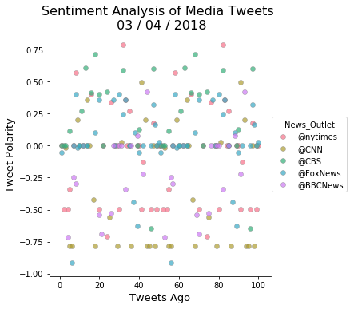

Background

In this assignment, you'll create a Python script to perform a sentiment analysis of the Twitter activity of various news oulets, and to present your findings visually.

Your final output should provide a visualized summary of the sentiments expressed in Tweets sent out by the following news organizations: BBC, CBS, CNN, Fox, and New York times.
The first plot will be and/or feature the following:

    Be a scatter plot of sentiments of the last 100 tweets sent out by each news organization, ranging from -1.0 to 1.0, where a score of 0 expresses a neutral sentiment, -1 the most negative sentiment possible, and +1 the most positive sentiment possible.
    Each plot point will reflect the compound sentiment of a tweet.
    Sort each plot point by its relative timestamp.

The second plot will be a bar plot visualizing the overall sentiments of the last 100 tweets from each organization. For this plot, you will again aggregate the compound sentiments analyzed by VADER.

The tools of the trade you will need for your task as a data analyst include the following: tweepy, pandas, matplotlib, seaborn, textblob, and VADER.

Your final Jupyter notebook must:

    Pull last 100 tweets from each outlet.
    Perform a sentiment analysis with the compound, positive, neutral, and negative scoring for each tweet.
    Pull into a DataFrame the tweet's source acount (user's name), its text, its date (created at), and its compound, positive, neutral, and negative sentiment scores.
    Export the data in the DataFrame into a CSV file.
    Save PNG images for each plot.

As final considerations:

    Use the Matplotlib and Seaborn libraries.
    Include a written description of three observable trends based on the data.
    Include proper labeling of your plots, including plot titles (with date of analysis) and axes labels.
    Include an exported markdown version of your Notebook called README.md in your GitHub repository.


```python
# Dependencies
import tweepy
import numpy as np
import pandas as pd
import matplotlib.pyplot as plt
from datetime import datetime
import os
import csv
from pprint import pprint
import seaborn as sns
# Import and Initialize Sentiment Analyzer
from vaderSentiment.vaderSentiment import SentimentIntensityAnalyzer
analyzer = SentimentIntensityAnalyzer()

# Twitter API Keys
consumer_key = "Mu92DNpvefQ4XfzeLnrwOPx99"
consumer_secret = "DybUt9nAcMZYtKporN8qyPig9JizczY6h3YsTah9Iy6nYVE7Xo"
access_token = "969394997077225473-uTQ6VIcY1zI5KjEzUl971BtKD5jPyac"
access_token_secret = "zWr5POWyJgY1HLEXSM5VQL8dB0PcNsoMJM0Tm6o1T9ARX"

# Setup Tweepy API Authentication
auth = tweepy.OAuthHandler(consumer_key, consumer_secret)
auth.set_access_token(access_token, access_token_secret)
api = tweepy.API(auth, wait_on_rate_limit=True, parser=tweepy.parsers.JSONParser())
```


```python
# Target Search Term
target_terms = ("@nytimes", "@CNN", "@CBS",
                "@FoxNews", "@BBCNews")
```


```python
# "Real Person" Filters
min_tweets = 5
max_tweets = 10000
max_followers = 2500
max_following = 2500
lang = "en"
```


```python
# Array to hold sentiment
sentiment_array = []
# Variables for holding sentiments
target_list=[]
source_list=[]
text_list=[]
created_list=[]
compound_list = []
positive_list = []
negative_list = []
neutral_list = []
cnt=[]
# Loop through all target users
for target in target_terms:
    counter=0

    # Variable for holding the oldest tweet
    oldest_tweet = None

    # make multiple requests
    for x in range(2):

        # Run search around each tweet
        public_tweets = api.search(
            target, count=50, result_type="recent", max_id=None)

            # Loop through all tweets
        for tweet in public_tweets["statuses"]:
            counter = counter + 1

            # Use filters to check if user meets conditions
            if (tweet["user"]["followers_count"] < max_followers
                and tweet["user"]["statuses_count"] > min_tweets
                and tweet["user"]["statuses_count"] < max_tweets
                and tweet["user"]["friends_count"] < max_following
                and tweet["user"]["lang"] == lang):

                # Run Vader Analysis on each tweet
                results = analyzer.polarity_scores(tweet["text"])
                compound = results["compound"]
                pos = results["pos"]
                neu = results["neu"]
                neg = results["neg"]

                # Add each value to the appropriate array
                target_list.append(target)
                source_list.append(tweet['user']['name'])
                created_list.append(tweet["created_at"])
                text_list.append(tweet["text"])
                compound_list.append(compound)
                positive_list.append(pos)
                negative_list.append(neg)
                neutral_list.append(neu)
                cnt.append(counter)
                
                # Set the new oldest_tweet value
        oldest_tweet = int(tweet["id_str"]) - 1

sentiment_df=pd.DataFrame({
                "News_Outlet": target_list,
                "Twitter_User":source_list,
                "Tweet_Text":text_list,
                "Created_At":created_list,
                "Compound": compound_list,
                "Positive": positive_list,
                "Neutral": neutral_list,
                "Negative": negative_list,
                "Tweets Ago": cnt
                })

#         # Set the new oldest_tweet value
#         oldest_tweet = int(tweet["id_str"]) - 1

    # Print the Sentiments
print(sentiment_df)

sentiment_df.to_csv('Output.csv', index=False)  
```

         Compound                      Created_At  Negative  Neutral News_Outlet  \
    0     -0.3252  Wed Mar 14 00:16:49 +0000 2018     0.226    0.774    @nytimes   
    1     -0.3612  Wed Mar 14 00:16:49 +0000 2018     0.216    0.631    @nytimes   
    2     -0.5267  Wed Mar 14 00:16:47 +0000 2018     0.298    0.702    @nytimes   
    3     -0.4939  Wed Mar 14 00:16:47 +0000 2018     0.160    0.840    @nytimes   
    4      0.0000  Wed Mar 14 00:16:46 +0000 2018     0.000    1.000    @nytimes   
    5     -0.4939  Wed Mar 14 00:16:46 +0000 2018     0.160    0.840    @nytimes   
    6     -0.4939  Wed Mar 14 00:16:45 +0000 2018     0.160    0.840    @nytimes   
    7      0.0000  Wed Mar 14 00:16:43 +0000 2018     0.000    1.000    @nytimes   
    8      0.0000  Wed Mar 14 00:16:42 +0000 2018     0.000    1.000    @nytimes   
    9      0.3182  Wed Mar 14 00:16:42 +0000 2018     0.000    0.901    @nytimes   
    10    -0.5965  Wed Mar 14 00:16:41 +0000 2018     0.177    0.823    @nytimes   
    11     0.0000  Wed Mar 14 00:16:38 +0000 2018     0.000    1.000    @nytimes   
    12     0.0000  Wed Mar 14 00:16:36 +0000 2018     0.000    1.000    @nytimes   
    13    -0.3595  Wed Mar 14 00:16:32 +0000 2018     0.106    0.894    @nytimes   
    14    -0.4939  Wed Mar 14 00:16:32 +0000 2018     0.160    0.840    @nytimes   
    15     0.4404  Wed Mar 14 00:16:31 +0000 2018     0.000    0.775    @nytimes   
    16     0.5994  Wed Mar 14 00:16:28 +0000 2018     0.047    0.800    @nytimes   
    17    -0.8016  Wed Mar 14 00:16:27 +0000 2018     0.506    0.494    @nytimes   
    18    -0.4939  Wed Mar 14 00:16:25 +0000 2018     0.160    0.840    @nytimes   
    19     0.1027  Wed Mar 14 00:16:24 +0000 2018     0.095    0.794    @nytimes   
    20    -0.8427  Wed Mar 14 00:16:24 +0000 2018     0.375    0.537    @nytimes   
    21     0.0000  Wed Mar 14 00:16:20 +0000 2018     0.000    1.000    @nytimes   
    22    -0.4939  Wed Mar 14 00:16:17 +0000 2018     0.160    0.840    @nytimes   
    23    -0.1280  Wed Mar 14 00:16:16 +0000 2018     0.193    0.632    @nytimes   
    24    -0.4939  Wed Mar 14 00:16:11 +0000 2018     0.160    0.840    @nytimes   
    25     0.4404  Wed Mar 14 00:16:11 +0000 2018     0.000    0.775    @nytimes   
    26     0.0762  Wed Mar 14 00:16:10 +0000 2018     0.000    0.844    @nytimes   
    27    -0.4939  Wed Mar 14 00:16:10 +0000 2018     0.160    0.840    @nytimes   
    28    -0.7269  Wed Mar 14 00:16:09 +0000 2018     0.243    0.757    @nytimes   
    29     0.0000  Wed Mar 14 00:16:07 +0000 2018     0.000    1.000    @nytimes   
    ..        ...                             ...       ...      ...         ...   
    176    0.0000  Wed Mar 14 00:13:13 +0000 2018     0.000    1.000    @BBCNews   
    177    0.4767  Wed Mar 14 00:13:04 +0000 2018     0.000    0.838    @BBCNews   
    178   -0.2500  Wed Mar 14 00:12:53 +0000 2018     0.143    0.756    @BBCNews   
    179    0.2500  Wed Mar 14 00:12:28 +0000 2018     0.000    0.895    @BBCNews   
    180    0.2732  Wed Mar 14 00:12:23 +0000 2018     0.098    0.756    @BBCNews   
    181   -0.0531  Wed Mar 14 00:11:57 +0000 2018     0.071    0.866    @BBCNews   
    182   -0.5859  Wed Mar 14 00:11:43 +0000 2018     0.322    0.678    @BBCNews   
    183    0.2960  Wed Mar 14 00:11:12 +0000 2018     0.000    0.694    @BBCNews   
    184    0.0000  Wed Mar 14 00:11:06 +0000 2018     0.000    1.000    @BBCNews   
    185   -0.3612  Wed Mar 14 00:16:53 +0000 2018     0.167    0.722    @BBCNews   
    186    0.8834  Wed Mar 14 00:16:16 +0000 2018     0.000    0.614    @BBCNews   
    187    0.0000  Wed Mar 14 00:16:09 +0000 2018     0.000    1.000    @BBCNews   
    188    0.3818  Wed Mar 14 00:16:00 +0000 2018     0.000    0.890    @BBCNews   
    189    0.0000  Wed Mar 14 00:15:55 +0000 2018     0.000    1.000    @BBCNews   
    190   -0.5859  Wed Mar 14 00:14:52 +0000 2018     0.213    0.787    @BBCNews   
    191   -0.5859  Wed Mar 14 00:14:41 +0000 2018     0.322    0.678    @BBCNews   
    192   -0.4767  Wed Mar 14 00:14:40 +0000 2018     0.147    0.853    @BBCNews   
    193    0.1280  Wed Mar 14 00:14:13 +0000 2018     0.000    0.769    @BBCNews   
    194   -0.6908  Wed Mar 14 00:14:12 +0000 2018     0.198    0.802    @BBCNews   
    195   -0.5859  Wed Mar 14 00:13:28 +0000 2018     0.322    0.678    @BBCNews   
    196    0.0000  Wed Mar 14 00:13:18 +0000 2018     0.000    1.000    @BBCNews   
    197    0.0000  Wed Mar 14 00:13:13 +0000 2018     0.000    1.000    @BBCNews   
    198    0.4767  Wed Mar 14 00:13:04 +0000 2018     0.000    0.838    @BBCNews   
    199   -0.2500  Wed Mar 14 00:12:53 +0000 2018     0.143    0.756    @BBCNews   
    200    0.2500  Wed Mar 14 00:12:28 +0000 2018     0.000    0.895    @BBCNews   
    201    0.2732  Wed Mar 14 00:12:23 +0000 2018     0.098    0.756    @BBCNews   
    202   -0.0531  Wed Mar 14 00:11:57 +0000 2018     0.071    0.866    @BBCNews   
    203   -0.5859  Wed Mar 14 00:11:43 +0000 2018     0.322    0.678    @BBCNews   
    204    0.2960  Wed Mar 14 00:11:12 +0000 2018     0.000    0.694    @BBCNews   
    205    0.0000  Wed Mar 14 00:11:06 +0000 2018     0.000    1.000    @BBCNews   
    
         Positive                                         Tweet_Text  Tweets Ago  \
    0       0.000  @nytimes Will never fly on United, especially ...           1   
    1       0.153  @PATRICIAMEEHA17 @cadigirl13 ALL GOOD AMERICAN...           2   
    2       0.000  @Redztar @nytimes California is a aids haven. ...           4   
    3       0.000  RT @nytimes: A spokesman for ICE has resigned....           5   
    4       0.000                    @nytimes Expensive toilet paper           6   
    5       0.000  RT @nytimes: A spokesman for ICE has resigned....           8   
    6       0.000  RT @nytimes: A spokesman for ICE has resigned....           9   
    7       0.000  RT @nedryun: Hey kids, don't look now, but  Re...          10   
    8       0.000  @KatyTurNBC @SenatorMenendez @MSNBC @CNN @AriM...          11   
    9       0.099  @nytimes This was in humane to let a passenger...          12   
    10      0.000  @edwardbrowden @nytimes I’m asking myself the ...          13   
    11      0.000                                   @nytimes LOLOLOL          16   
    12      0.000                                   @nytimes Bravo!!          17   
    13      0.000  RT @CITES: We must &amp; we can stop the poach...          19   
    14      0.000  RT @nytimes: A spokesman for ICE has resigned....          20   
    15      0.225  RT @NickBaumann: Good job on this no-bullshit ...          21   
    16      0.153  RT @MujMash: Donald Trump was born on a rainy ...          25   
    17      0.000  @nytimes So sad the dog lost its life to human...          27   
    18      0.000  RT @nytimes: A spokesman for ICE has resigned,...          31   
    19      0.111  RT @nytimes: Venezuela placed the opposition l...          32   
    20      0.088  @nytimes I don't care if I had to miss my own ...          33   
    21      0.000  RT @PlanetZiggurat: https://t.co/VOEUjnISk5 is...          37   
    22      0.000  RT @nytimes: A spokesman for ICE has resigned....          39   
    23      0.175  @Dria39 @nytimes Exactly. If you treat your do...          41   
    24      0.000  RT @nytimes: A spokesman for ICE has resigned....          43   
    25      0.225  RT @NickBaumann: Good job on this no-bullshit ...          44   
    26      0.156           @nytimes You couldn't pay ME to take it.          45   
    27      0.000  RT @nytimes: A spokesman for ICE has resigned....          47   
    28      0.000  REAL STORY:  Rex Tillerson Fired the Day After...          48   
    29      0.000  RT @edwardbrowden: @nytimes Why is this airlin...          49   
    ..        ...                                                ...         ...   
    176     0.000  @bajablonski @NadineDorries @BBCNews Not a MSM...          32   
    177     0.162  @DevRacing @BBCNews You assuming that the UK k...          34   
    178     0.101  RT @Greekboy8: RT I suggest this video showing...          35   
    179     0.105  @fergie096 @jedell2006 @BBCScotlandNews @BBCNe...          37   
    180     0.147  @FreeSpeechGB @BBCNews Is the Silicon Valley a...          38   
    181     0.063  @BBCNews @AllieHBNews The Express is getting c...          41   
    182     0.000  RT @BBCNews: Russian spy: Poisoning response d...          42   
    183     0.306                @BBCNews This whole story is a joke          47   
    184     0.000  @BBCNews A revived Royal House @HolyRoyalFamil...          48   
    185     0.110  RT @SinnersCafe: I'm an evil genius.\n\n#Skrip...          52   
    186     0.386  @BBCNews That’s done her credibility the world...          54   
    187     0.000  RT @charitycarol: @BBCNews @PhilipHammondUK Fr...          55   
    188     0.110  @BBCNews dear brain washed people here is a ru...          56   
    189     0.000  @BBCNews Learn our place! whatever #Government...          58   
    190     0.000  RT @BBCNews: Tuesday's Times: "May gives Putin...          70   
    191     0.000  RT @BBCNews: Russian spy: Poisoning response d...          73   
    192     0.000  @DrMerle @BBCNews @UN UN has become worse than...          74   
    193     0.231               @BBCNews Is the deadline even legal?          76   
    194     0.000  RT @BenBarryJones: Stories on @BBCNews given a...          77   
    195     0.000  RT @BBCNews: Russian spy: Poisoning response d...          79   
    196     0.000  RT @Royal_Judah: @BBCNews A revived Royal Hous...          81   
    197     0.000  @bajablonski @NadineDorries @BBCNews Not a MSM...          82   
    198     0.162  @DevRacing @BBCNews You assuming that the UK k...          84   
    199     0.101  RT @Greekboy8: RT I suggest this video showing...          85   
    200     0.105  @fergie096 @jedell2006 @BBCScotlandNews @BBCNe...          87   
    201     0.147  @FreeSpeechGB @BBCNews Is the Silicon Valley a...          88   
    202     0.063  @BBCNews @AllieHBNews The Express is getting c...          91   
    203     0.000  RT @BBCNews: Russian spy: Poisoning response d...          92   
    204     0.306                @BBCNews This whole story is a joke          97   
    205     0.000  @BBCNews A revived Royal House @HolyRoyalFamil...          98   
    
                   Twitter_User  
    0               Lisa Babyak  
    1              BUCKY JORDAN  
    2            Drew Peacock 💎  
    3                       Sue  
    4           Zachary Spencer  
    5             Brenda Mendes  
    6           SuzyCreamCheese  
    7                  Joyce 🇺🇸  
    8             THELONEWOLVES  
    9                Hulda Reed  
    10       BGCRealWorldTweets  
    11              Cory Hansen  
    12         Andrea Childreth  
    13   Clemens Communications  
    14           Mosaic Phoenix  
    15          Craig Buschmann  
    16            Mariam Attaie  
    17                     dave  
    18           Angel Chambers  
    19           Jorge Gerardin  
    20                    Meg G  
    21                    Rifay  
    22             Stephen Wood  
    23                      End  
    24               K Benjamin  
    25                   skeats  
    26                      VPU  
    27                      Sal  
    28        @SheilaLMcCrea JD  
    29       BGCRealWorldTweets  
    ..                      ...  
    176                     Red  
    177           Stephen Gould  
    178                    Dave  
    179                OC Spurs  
    180              Dan Backer  
    181             Mark Voller  
    182           BERNARD KELLY  
    183                Kenzie🇬🇧  
    184    Royal House of Judah  
    185           Chilli Palmer  
    186    OFFICIALJamie Murphy  
    187               julie gee  
    188       tatiana sinyukova  
    189                  Blakey  
    190   Kathleen Treacy (Kay)  
    191       Samantha Delamore  
    192     E N I G M A fashion  
    193            Lorrainemuir  
    194                 Bagpuss  
    195             Lisa Kelley  
    196             The HookedX  
    197                     Red  
    198           Stephen Gould  
    199                    Dave  
    200                OC Spurs  
    201              Dan Backer  
    202             Mark Voller  
    203           BERNARD KELLY  
    204                Kenzie🇬🇧  
    205    Royal House of Judah  
    
    [206 rows x 9 columns]


```python
# pprint(public_tweets)
```


```python
senti=sentiment_df[['News_Outlet', 'Twitter_User','Created_At', 'Tweet_Text', 
                    'Compound','Positive','Neutral','Negative','Tweets Ago']]
senti
```


<div>
<style>
    .dataframe thead tr:only-child th {
        text-align: right;
    }

    .dataframe thead th {
        text-align: left;
    }

    .dataframe tbody tr th {
        vertical-align: top;
    }
</style>
<table border="1" class="dataframe">
  <thead>
    <tr style="text-align: right;">
      <th></th>
      <th>News_Outlet</th>
      <th>Twitter_User</th>
      <th>Created_At</th>
      <th>Tweet_Text</th>
      <th>Compound</th>
      <th>Positive</th>
      <th>Neutral</th>
      <th>Negative</th>
      <th>Tweets Ago</th>
    </tr>
  </thead>
  <tbody>
    <tr>
      <th>0</th>
      <td>@nytimes</td>
      <td>Lisa Babyak</td>
      <td>Wed Mar 14 00:16:49 +0000 2018</td>
      <td>@nytimes Will never fly on United, especially ...</td>
      <td>-0.3252</td>
      <td>0.000</td>
      <td>0.774</td>
      <td>0.226</td>
      <td>1</td>
    </tr>
    <tr>
      <th>1</th>
      <td>@nytimes</td>
      <td>BUCKY JORDAN</td>
      <td>Wed Mar 14 00:16:49 +0000 2018</td>
      <td>@PATRICIAMEEHA17 @cadigirl13 ALL GOOD AMERICAN...</td>
      <td>-0.3612</td>
      <td>0.153</td>
      <td>0.631</td>
      <td>0.216</td>
      <td>2</td>
    </tr>
    <tr>
      <th>2</th>
      <td>@nytimes</td>
      <td>Drew Peacock 💎</td>
      <td>Wed Mar 14 00:16:47 +0000 2018</td>
      <td>@Redztar @nytimes California is a aids haven. ...</td>
      <td>-0.5267</td>
      <td>0.000</td>
      <td>0.702</td>
      <td>0.298</td>
      <td>4</td>
    </tr>
    <tr>
      <th>3</th>
      <td>@nytimes</td>
      <td>Sue</td>
      <td>Wed Mar 14 00:16:47 +0000 2018</td>
      <td>RT @nytimes: A spokesman for ICE has resigned....</td>
      <td>-0.4939</td>
      <td>0.000</td>
      <td>0.840</td>
      <td>0.160</td>
      <td>5</td>
    </tr>
    <tr>
      <th>4</th>
      <td>@nytimes</td>
      <td>Zachary Spencer</td>
      <td>Wed Mar 14 00:16:46 +0000 2018</td>
      <td>@nytimes Expensive toilet paper</td>
      <td>0.0000</td>
      <td>0.000</td>
      <td>1.000</td>
      <td>0.000</td>
      <td>6</td>
    </tr>
    <tr>
      <th>5</th>
      <td>@nytimes</td>
      <td>Brenda Mendes</td>
      <td>Wed Mar 14 00:16:46 +0000 2018</td>
      <td>RT @nytimes: A spokesman for ICE has resigned....</td>
      <td>-0.4939</td>
      <td>0.000</td>
      <td>0.840</td>
      <td>0.160</td>
      <td>8</td>
    </tr>
    <tr>
      <th>6</th>
      <td>@nytimes</td>
      <td>SuzyCreamCheese</td>
      <td>Wed Mar 14 00:16:45 +0000 2018</td>
      <td>RT @nytimes: A spokesman for ICE has resigned....</td>
      <td>-0.4939</td>
      <td>0.000</td>
      <td>0.840</td>
      <td>0.160</td>
      <td>9</td>
    </tr>
    <tr>
      <th>7</th>
      <td>@nytimes</td>
      <td>Joyce 🇺🇸</td>
      <td>Wed Mar 14 00:16:43 +0000 2018</td>
      <td>RT @nedryun: Hey kids, don't look now, but  Re...</td>
      <td>0.0000</td>
      <td>0.000</td>
      <td>1.000</td>
      <td>0.000</td>
      <td>10</td>
    </tr>
    <tr>
      <th>8</th>
      <td>@nytimes</td>
      <td>THELONEWOLVES</td>
      <td>Wed Mar 14 00:16:42 +0000 2018</td>
      <td>@KatyTurNBC @SenatorMenendez @MSNBC @CNN @AriM...</td>
      <td>0.0000</td>
      <td>0.000</td>
      <td>1.000</td>
      <td>0.000</td>
      <td>11</td>
    </tr>
    <tr>
      <th>9</th>
      <td>@nytimes</td>
      <td>Hulda Reed</td>
      <td>Wed Mar 14 00:16:42 +0000 2018</td>
      <td>@nytimes This was in humane to let a passenger...</td>
      <td>0.3182</td>
      <td>0.099</td>
      <td>0.901</td>
      <td>0.000</td>
      <td>12</td>
    </tr>
    <tr>
      <th>10</th>
      <td>@nytimes</td>
      <td>BGCRealWorldTweets</td>
      <td>Wed Mar 14 00:16:41 +0000 2018</td>
      <td>@edwardbrowden @nytimes I’m asking myself the ...</td>
      <td>-0.5965</td>
      <td>0.000</td>
      <td>0.823</td>
      <td>0.177</td>
      <td>13</td>
    </tr>
    <tr>
      <th>11</th>
      <td>@nytimes</td>
      <td>Cory Hansen</td>
      <td>Wed Mar 14 00:16:38 +0000 2018</td>
      <td>@nytimes LOLOLOL</td>
      <td>0.0000</td>
      <td>0.000</td>
      <td>1.000</td>
      <td>0.000</td>
      <td>16</td>
    </tr>
    <tr>
      <th>12</th>
      <td>@nytimes</td>
      <td>Andrea Childreth</td>
      <td>Wed Mar 14 00:16:36 +0000 2018</td>
      <td>@nytimes Bravo!!</td>
      <td>0.0000</td>
      <td>0.000</td>
      <td>1.000</td>
      <td>0.000</td>
      <td>17</td>
    </tr>
    <tr>
      <th>13</th>
      <td>@nytimes</td>
      <td>Clemens Communications</td>
      <td>Wed Mar 14 00:16:32 +0000 2018</td>
      <td>RT @CITES: We must &amp;amp; we can stop the poach...</td>
      <td>-0.3595</td>
      <td>0.000</td>
      <td>0.894</td>
      <td>0.106</td>
      <td>19</td>
    </tr>
    <tr>
      <th>14</th>
      <td>@nytimes</td>
      <td>Mosaic Phoenix</td>
      <td>Wed Mar 14 00:16:32 +0000 2018</td>
      <td>RT @nytimes: A spokesman for ICE has resigned....</td>
      <td>-0.4939</td>
      <td>0.000</td>
      <td>0.840</td>
      <td>0.160</td>
      <td>20</td>
    </tr>
    <tr>
      <th>15</th>
      <td>@nytimes</td>
      <td>Craig Buschmann</td>
      <td>Wed Mar 14 00:16:31 +0000 2018</td>
      <td>RT @NickBaumann: Good job on this no-bullshit ...</td>
      <td>0.4404</td>
      <td>0.225</td>
      <td>0.775</td>
      <td>0.000</td>
      <td>21</td>
    </tr>
    <tr>
      <th>16</th>
      <td>@nytimes</td>
      <td>Mariam Attaie</td>
      <td>Wed Mar 14 00:16:28 +0000 2018</td>
      <td>RT @MujMash: Donald Trump was born on a rainy ...</td>
      <td>0.5994</td>
      <td>0.153</td>
      <td>0.800</td>
      <td>0.047</td>
      <td>25</td>
    </tr>
    <tr>
      <th>17</th>
      <td>@nytimes</td>
      <td>dave</td>
      <td>Wed Mar 14 00:16:27 +0000 2018</td>
      <td>@nytimes So sad the dog lost its life to human...</td>
      <td>-0.8016</td>
      <td>0.000</td>
      <td>0.494</td>
      <td>0.506</td>
      <td>27</td>
    </tr>
    <tr>
      <th>18</th>
      <td>@nytimes</td>
      <td>Angel Chambers</td>
      <td>Wed Mar 14 00:16:25 +0000 2018</td>
      <td>RT @nytimes: A spokesman for ICE has resigned,...</td>
      <td>-0.4939</td>
      <td>0.000</td>
      <td>0.840</td>
      <td>0.160</td>
      <td>31</td>
    </tr>
    <tr>
      <th>19</th>
      <td>@nytimes</td>
      <td>Jorge Gerardin</td>
      <td>Wed Mar 14 00:16:24 +0000 2018</td>
      <td>RT @nytimes: Venezuela placed the opposition l...</td>
      <td>0.1027</td>
      <td>0.111</td>
      <td>0.794</td>
      <td>0.095</td>
      <td>32</td>
    </tr>
    <tr>
      <th>20</th>
      <td>@nytimes</td>
      <td>Meg G</td>
      <td>Wed Mar 14 00:16:24 +0000 2018</td>
      <td>@nytimes I don't care if I had to miss my own ...</td>
      <td>-0.8427</td>
      <td>0.088</td>
      <td>0.537</td>
      <td>0.375</td>
      <td>33</td>
    </tr>
    <tr>
      <th>21</th>
      <td>@nytimes</td>
      <td>Rifay</td>
      <td>Wed Mar 14 00:16:20 +0000 2018</td>
      <td>RT @PlanetZiggurat: https://t.co/VOEUjnISk5 is...</td>
      <td>0.0000</td>
      <td>0.000</td>
      <td>1.000</td>
      <td>0.000</td>
      <td>37</td>
    </tr>
    <tr>
      <th>22</th>
      <td>@nytimes</td>
      <td>Stephen Wood</td>
      <td>Wed Mar 14 00:16:17 +0000 2018</td>
      <td>RT @nytimes: A spokesman for ICE has resigned....</td>
      <td>-0.4939</td>
      <td>0.000</td>
      <td>0.840</td>
      <td>0.160</td>
      <td>39</td>
    </tr>
    <tr>
      <th>23</th>
      <td>@nytimes</td>
      <td>End</td>
      <td>Wed Mar 14 00:16:16 +0000 2018</td>
      <td>@Dria39 @nytimes Exactly. If you treat your do...</td>
      <td>-0.1280</td>
      <td>0.175</td>
      <td>0.632</td>
      <td>0.193</td>
      <td>41</td>
    </tr>
    <tr>
      <th>24</th>
      <td>@nytimes</td>
      <td>K Benjamin</td>
      <td>Wed Mar 14 00:16:11 +0000 2018</td>
      <td>RT @nytimes: A spokesman for ICE has resigned....</td>
      <td>-0.4939</td>
      <td>0.000</td>
      <td>0.840</td>
      <td>0.160</td>
      <td>43</td>
    </tr>
    <tr>
      <th>25</th>
      <td>@nytimes</td>
      <td>skeats</td>
      <td>Wed Mar 14 00:16:11 +0000 2018</td>
      <td>RT @NickBaumann: Good job on this no-bullshit ...</td>
      <td>0.4404</td>
      <td>0.225</td>
      <td>0.775</td>
      <td>0.000</td>
      <td>44</td>
    </tr>
    <tr>
      <th>26</th>
      <td>@nytimes</td>
      <td>VPU</td>
      <td>Wed Mar 14 00:16:10 +0000 2018</td>
      <td>@nytimes You couldn't pay ME to take it.</td>
      <td>0.0762</td>
      <td>0.156</td>
      <td>0.844</td>
      <td>0.000</td>
      <td>45</td>
    </tr>
    <tr>
      <th>27</th>
      <td>@nytimes</td>
      <td>Sal</td>
      <td>Wed Mar 14 00:16:10 +0000 2018</td>
      <td>RT @nytimes: A spokesman for ICE has resigned....</td>
      <td>-0.4939</td>
      <td>0.000</td>
      <td>0.840</td>
      <td>0.160</td>
      <td>47</td>
    </tr>
    <tr>
      <th>28</th>
      <td>@nytimes</td>
      <td>@SheilaLMcCrea JD</td>
      <td>Wed Mar 14 00:16:09 +0000 2018</td>
      <td>REAL STORY:  Rex Tillerson Fired the Day After...</td>
      <td>-0.7269</td>
      <td>0.000</td>
      <td>0.757</td>
      <td>0.243</td>
      <td>48</td>
    </tr>
    <tr>
      <th>29</th>
      <td>@nytimes</td>
      <td>BGCRealWorldTweets</td>
      <td>Wed Mar 14 00:16:07 +0000 2018</td>
      <td>RT @edwardbrowden: @nytimes Why is this airlin...</td>
      <td>0.0000</td>
      <td>0.000</td>
      <td>1.000</td>
      <td>0.000</td>
      <td>49</td>
    </tr>
    <tr>
      <th>...</th>
      <td>...</td>
      <td>...</td>
      <td>...</td>
      <td>...</td>
      <td>...</td>
      <td>...</td>
      <td>...</td>
      <td>...</td>
      <td>...</td>
    </tr>
    <tr>
      <th>176</th>
      <td>@BBCNews</td>
      <td>Red</td>
      <td>Wed Mar 14 00:13:13 +0000 2018</td>
      <td>@bajablonski @NadineDorries @BBCNews Not a MSM...</td>
      <td>0.0000</td>
      <td>0.000</td>
      <td>1.000</td>
      <td>0.000</td>
      <td>32</td>
    </tr>
    <tr>
      <th>177</th>
      <td>@BBCNews</td>
      <td>Stephen Gould</td>
      <td>Wed Mar 14 00:13:04 +0000 2018</td>
      <td>@DevRacing @BBCNews You assuming that the UK k...</td>
      <td>0.4767</td>
      <td>0.162</td>
      <td>0.838</td>
      <td>0.000</td>
      <td>34</td>
    </tr>
    <tr>
      <th>178</th>
      <td>@BBCNews</td>
      <td>Dave</td>
      <td>Wed Mar 14 00:12:53 +0000 2018</td>
      <td>RT @Greekboy8: RT I suggest this video showing...</td>
      <td>-0.2500</td>
      <td>0.101</td>
      <td>0.756</td>
      <td>0.143</td>
      <td>35</td>
    </tr>
    <tr>
      <th>179</th>
      <td>@BBCNews</td>
      <td>OC Spurs</td>
      <td>Wed Mar 14 00:12:28 +0000 2018</td>
      <td>@fergie096 @jedell2006 @BBCScotlandNews @BBCNe...</td>
      <td>0.2500</td>
      <td>0.105</td>
      <td>0.895</td>
      <td>0.000</td>
      <td>37</td>
    </tr>
    <tr>
      <th>180</th>
      <td>@BBCNews</td>
      <td>Dan Backer</td>
      <td>Wed Mar 14 00:12:23 +0000 2018</td>
      <td>@FreeSpeechGB @BBCNews Is the Silicon Valley a...</td>
      <td>0.2732</td>
      <td>0.147</td>
      <td>0.756</td>
      <td>0.098</td>
      <td>38</td>
    </tr>
    <tr>
      <th>181</th>
      <td>@BBCNews</td>
      <td>Mark Voller</td>
      <td>Wed Mar 14 00:11:57 +0000 2018</td>
      <td>@BBCNews @AllieHBNews The Express is getting c...</td>
      <td>-0.0531</td>
      <td>0.063</td>
      <td>0.866</td>
      <td>0.071</td>
      <td>41</td>
    </tr>
    <tr>
      <th>182</th>
      <td>@BBCNews</td>
      <td>BERNARD KELLY</td>
      <td>Wed Mar 14 00:11:43 +0000 2018</td>
      <td>RT @BBCNews: Russian spy: Poisoning response d...</td>
      <td>-0.5859</td>
      <td>0.000</td>
      <td>0.678</td>
      <td>0.322</td>
      <td>42</td>
    </tr>
    <tr>
      <th>183</th>
      <td>@BBCNews</td>
      <td>Kenzie🇬🇧</td>
      <td>Wed Mar 14 00:11:12 +0000 2018</td>
      <td>@BBCNews This whole story is a joke</td>
      <td>0.2960</td>
      <td>0.306</td>
      <td>0.694</td>
      <td>0.000</td>
      <td>47</td>
    </tr>
    <tr>
      <th>184</th>
      <td>@BBCNews</td>
      <td>Royal House of Judah</td>
      <td>Wed Mar 14 00:11:06 +0000 2018</td>
      <td>@BBCNews A revived Royal House @HolyRoyalFamil...</td>
      <td>0.0000</td>
      <td>0.000</td>
      <td>1.000</td>
      <td>0.000</td>
      <td>48</td>
    </tr>
    <tr>
      <th>185</th>
      <td>@BBCNews</td>
      <td>Chilli Palmer</td>
      <td>Wed Mar 14 00:16:53 +0000 2018</td>
      <td>RT @SinnersCafe: I'm an evil genius.\n\n#Skrip...</td>
      <td>-0.3612</td>
      <td>0.110</td>
      <td>0.722</td>
      <td>0.167</td>
      <td>52</td>
    </tr>
    <tr>
      <th>186</th>
      <td>@BBCNews</td>
      <td>OFFICIALJamie Murphy</td>
      <td>Wed Mar 14 00:16:16 +0000 2018</td>
      <td>@BBCNews That’s done her credibility the world...</td>
      <td>0.8834</td>
      <td>0.386</td>
      <td>0.614</td>
      <td>0.000</td>
      <td>54</td>
    </tr>
    <tr>
      <th>187</th>
      <td>@BBCNews</td>
      <td>julie gee</td>
      <td>Wed Mar 14 00:16:09 +0000 2018</td>
      <td>RT @charitycarol: @BBCNews @PhilipHammondUK Fr...</td>
      <td>0.0000</td>
      <td>0.000</td>
      <td>1.000</td>
      <td>0.000</td>
      <td>55</td>
    </tr>
    <tr>
      <th>188</th>
      <td>@BBCNews</td>
      <td>tatiana sinyukova</td>
      <td>Wed Mar 14 00:16:00 +0000 2018</td>
      <td>@BBCNews dear brain washed people here is a ru...</td>
      <td>0.3818</td>
      <td>0.110</td>
      <td>0.890</td>
      <td>0.000</td>
      <td>56</td>
    </tr>
    <tr>
      <th>189</th>
      <td>@BBCNews</td>
      <td>Blakey</td>
      <td>Wed Mar 14 00:15:55 +0000 2018</td>
      <td>@BBCNews Learn our place! whatever #Government...</td>
      <td>0.0000</td>
      <td>0.000</td>
      <td>1.000</td>
      <td>0.000</td>
      <td>58</td>
    </tr>
    <tr>
      <th>190</th>
      <td>@BBCNews</td>
      <td>Kathleen Treacy (Kay)</td>
      <td>Wed Mar 14 00:14:52 +0000 2018</td>
      <td>RT @BBCNews: Tuesday's Times: "May gives Putin...</td>
      <td>-0.5859</td>
      <td>0.000</td>
      <td>0.787</td>
      <td>0.213</td>
      <td>70</td>
    </tr>
    <tr>
      <th>191</th>
      <td>@BBCNews</td>
      <td>Samantha Delamore</td>
      <td>Wed Mar 14 00:14:41 +0000 2018</td>
      <td>RT @BBCNews: Russian spy: Poisoning response d...</td>
      <td>-0.5859</td>
      <td>0.000</td>
      <td>0.678</td>
      <td>0.322</td>
      <td>73</td>
    </tr>
    <tr>
      <th>192</th>
      <td>@BBCNews</td>
      <td>E N I G M A fashion</td>
      <td>Wed Mar 14 00:14:40 +0000 2018</td>
      <td>@DrMerle @BBCNews @UN UN has become worse than...</td>
      <td>-0.4767</td>
      <td>0.000</td>
      <td>0.853</td>
      <td>0.147</td>
      <td>74</td>
    </tr>
    <tr>
      <th>193</th>
      <td>@BBCNews</td>
      <td>Lorrainemuir</td>
      <td>Wed Mar 14 00:14:13 +0000 2018</td>
      <td>@BBCNews Is the deadline even legal?</td>
      <td>0.1280</td>
      <td>0.231</td>
      <td>0.769</td>
      <td>0.000</td>
      <td>76</td>
    </tr>
    <tr>
      <th>194</th>
      <td>@BBCNews</td>
      <td>Bagpuss</td>
      <td>Wed Mar 14 00:14:12 +0000 2018</td>
      <td>RT @BenBarryJones: Stories on @BBCNews given a...</td>
      <td>-0.6908</td>
      <td>0.000</td>
      <td>0.802</td>
      <td>0.198</td>
      <td>77</td>
    </tr>
    <tr>
      <th>195</th>
      <td>@BBCNews</td>
      <td>Lisa Kelley</td>
      <td>Wed Mar 14 00:13:28 +0000 2018</td>
      <td>RT @BBCNews: Russian spy: Poisoning response d...</td>
      <td>-0.5859</td>
      <td>0.000</td>
      <td>0.678</td>
      <td>0.322</td>
      <td>79</td>
    </tr>
    <tr>
      <th>196</th>
      <td>@BBCNews</td>
      <td>The HookedX</td>
      <td>Wed Mar 14 00:13:18 +0000 2018</td>
      <td>RT @Royal_Judah: @BBCNews A revived Royal Hous...</td>
      <td>0.0000</td>
      <td>0.000</td>
      <td>1.000</td>
      <td>0.000</td>
      <td>81</td>
    </tr>
    <tr>
      <th>197</th>
      <td>@BBCNews</td>
      <td>Red</td>
      <td>Wed Mar 14 00:13:13 +0000 2018</td>
      <td>@bajablonski @NadineDorries @BBCNews Not a MSM...</td>
      <td>0.0000</td>
      <td>0.000</td>
      <td>1.000</td>
      <td>0.000</td>
      <td>82</td>
    </tr>
    <tr>
      <th>198</th>
      <td>@BBCNews</td>
      <td>Stephen Gould</td>
      <td>Wed Mar 14 00:13:04 +0000 2018</td>
      <td>@DevRacing @BBCNews You assuming that the UK k...</td>
      <td>0.4767</td>
      <td>0.162</td>
      <td>0.838</td>
      <td>0.000</td>
      <td>84</td>
    </tr>
    <tr>
      <th>199</th>
      <td>@BBCNews</td>
      <td>Dave</td>
      <td>Wed Mar 14 00:12:53 +0000 2018</td>
      <td>RT @Greekboy8: RT I suggest this video showing...</td>
      <td>-0.2500</td>
      <td>0.101</td>
      <td>0.756</td>
      <td>0.143</td>
      <td>85</td>
    </tr>
    <tr>
      <th>200</th>
      <td>@BBCNews</td>
      <td>OC Spurs</td>
      <td>Wed Mar 14 00:12:28 +0000 2018</td>
      <td>@fergie096 @jedell2006 @BBCScotlandNews @BBCNe...</td>
      <td>0.2500</td>
      <td>0.105</td>
      <td>0.895</td>
      <td>0.000</td>
      <td>87</td>
    </tr>
    <tr>
      <th>201</th>
      <td>@BBCNews</td>
      <td>Dan Backer</td>
      <td>Wed Mar 14 00:12:23 +0000 2018</td>
      <td>@FreeSpeechGB @BBCNews Is the Silicon Valley a...</td>
      <td>0.2732</td>
      <td>0.147</td>
      <td>0.756</td>
      <td>0.098</td>
      <td>88</td>
    </tr>
    <tr>
      <th>202</th>
      <td>@BBCNews</td>
      <td>Mark Voller</td>
      <td>Wed Mar 14 00:11:57 +0000 2018</td>
      <td>@BBCNews @AllieHBNews The Express is getting c...</td>
      <td>-0.0531</td>
      <td>0.063</td>
      <td>0.866</td>
      <td>0.071</td>
      <td>91</td>
    </tr>
    <tr>
      <th>203</th>
      <td>@BBCNews</td>
      <td>BERNARD KELLY</td>
      <td>Wed Mar 14 00:11:43 +0000 2018</td>
      <td>RT @BBCNews: Russian spy: Poisoning response d...</td>
      <td>-0.5859</td>
      <td>0.000</td>
      <td>0.678</td>
      <td>0.322</td>
      <td>92</td>
    </tr>
    <tr>
      <th>204</th>
      <td>@BBCNews</td>
      <td>Kenzie🇬🇧</td>
      <td>Wed Mar 14 00:11:12 +0000 2018</td>
      <td>@BBCNews This whole story is a joke</td>
      <td>0.2960</td>
      <td>0.306</td>
      <td>0.694</td>
      <td>0.000</td>
      <td>97</td>
    </tr>
    <tr>
      <th>205</th>
      <td>@BBCNews</td>
      <td>Royal House of Judah</td>
      <td>Wed Mar 14 00:11:06 +0000 2018</td>
      <td>@BBCNews A revived Royal House @HolyRoyalFamil...</td>
      <td>0.0000</td>
      <td>0.000</td>
      <td>1.000</td>
      <td>0.000</td>
      <td>98</td>
    </tr>
  </tbody>
</table>
<p>206 rows × 9 columns</p>
</div>


```python
sns.lmplot(x="Tweets Ago", y="Compound", 
           data=senti, fit_reg=False, hue="News_Outlet", 
           palette="husl", legend=True,
           scatter_kws={
               "edgecolor":"grey",
               "linewidth":0.5,
               "alpha":0.7
           })

plt.title("Sentiment Analysis of Media Tweets \n 03 / 04 / 2018", size=16)
plt.ylabel("Tweet Polarity", size=13)
plt.xlabel("Tweets Ago", size=13)
plt.show()
plt.savefig("sentimentfig") 
```





```python

```


    <matplotlib.axes._subplots.AxesSubplot at 0x10f904d30>


